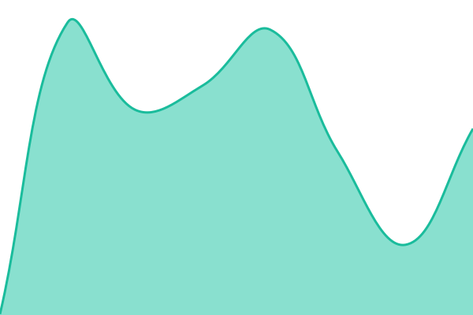
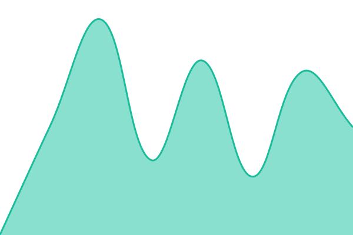
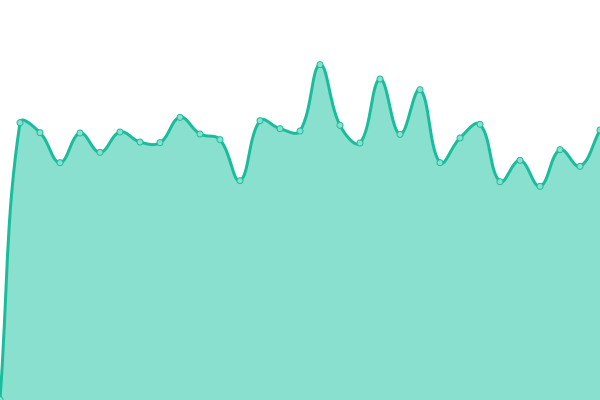
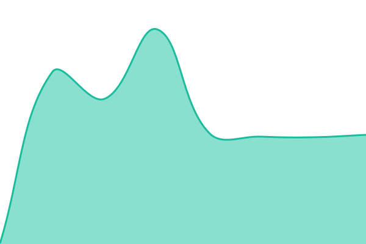
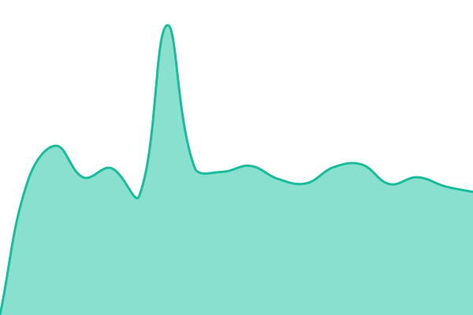
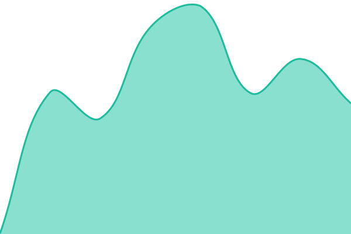
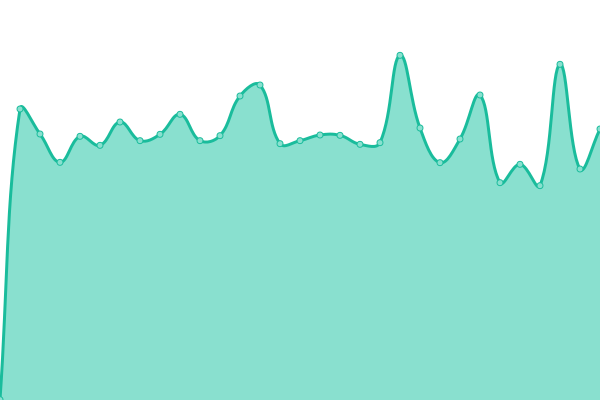
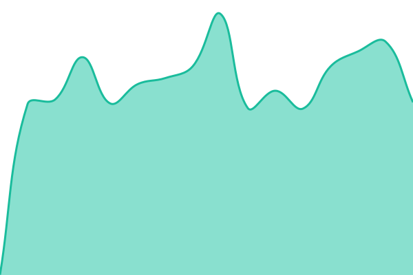

# [📈 Live Status](https://demo.upptime.js.org): <!--live status--> **🟧 Partial outage**

This repository contains the open-source uptime monitor and status page for [datavoid-team](https://demo.upptime.js.org), powered by [Upptime](https://github.com/upptime/upptime).

With [Upptime](https://upptime.js.org), you can get your own unlimited and free uptime monitor and status page, powered entirely by a GitHub repository. We use [Issues](https://github.com/datavoid-team/monitor/issues) as incident reports, [Actions](https://github.com/datavoid-team/monitor/actions) as uptime monitors, and [Pages](https://demo.upptime.js.org) for the status page.

<!--start: status pages-->
<!-- This summary is generated by Upptime (https://github.com/upptime/upptime) -->
<!-- Do not edit this manually, your changes will be overwritten -->
<!-- prettier-ignore -->
| URL | Status | History | Response Time | Uptime |
| --- | ------ | ------- | ------------- | ------ |
|  [Home](https://www.datavoid.in) | 🟩 Up | [home.yml](https://github.com/datavoid-team/monitor/commits/HEAD/history/home.yml) | 

 371ms
     
 | 

<a href="https://status.datavoid.in/history/home">98.28%</a>
    

|  [Blog](https://blog.datavoid.in) | 🟩 Up | [blog.yml](https://github.com/datavoid-team/monitor/commits/HEAD/history/blog.yml) | 

 388ms
     
 | 

<a href="https://status.datavoid.in/history/blog">97.81%</a>
    

|  [Cloud](https://cloud.datavoid.in) | 🟩 Up | [cloud.yml](https://github.com/datavoid-team/monitor/commits/HEAD/history/cloud.yml) | 

 1392ms
     
 | 

<a href="https://status.datavoid.in/history/cloud">63.98%</a>
    

|  [Hosting Service](https://server.datavoid.in) | 🟩 Up | [hosting-service.yml](https://github.com/datavoid-team/monitor/commits/HEAD/history/hosting-service.yml) | 

 314ms
     
 | 

<a href="https://status.datavoid.in/history/hosting-service">98.92%</a>
    

|  [Downloader](https://download.datavoid.in) | 🟥 Down | [downloader.yml](https://github.com/datavoid-team/monitor/commits/HEAD/history/downloader.yml) | 

 0ms
     
 | 

<a href="https://status.datavoid.in/history/downloader">100.00%</a>
    

|  [HelpDesk](https://help.datavoid.in) | 🟩 Up | [help-desk.yml](https://github.com/datavoid-team/monitor/commits/HEAD/history/help-desk.yml) | 

 336ms
     
 | 

<a href="https://status.datavoid.in/history/help-desk">97.82%</a>
    

|  [Scam Checker](https://scamcheck.datavoid.in) | 🟩 Up | [scam-checker.yml](https://github.com/datavoid-team/monitor/commits/HEAD/history/scam-checker.yml) | 

 317ms
     
 | 

<a href="https://status.datavoid.in/history/scam-checker">98.15%</a>
    

|  [Affiliate Login](https://affiliate.datavoid.in) | 🟩 Up | [affiliate-login.yml](https://github.com/datavoid-team/monitor/commits/HEAD/history/affiliate-login.yml) | 

 376ms
     
 | 

<a href="https://status.datavoid.in/history/affiliate-login">98.65%</a>
    

|  [DataVoid Events](https://events.datavoid.in) | 🟩 Up | [data-void-events.yml](https://github.com/datavoid-team/monitor/commits/HEAD/history/data-void-events.yml) | 

 1929ms
     
 | 

<a href="https://status.datavoid.in/history/data-void-events">86.15%</a>
    

|  [DataVoid Search](https://search.datavoid.in) | 🟩 Up | [data-void-search.yml](https://github.com/datavoid-team/monitor/commits/HEAD/history/data-void-search.yml) | 

 2033ms
     
 | 

<a href="https://status.datavoid.in/history/data-void-search">86.19%</a>
    

|  [DataVoid Editor](https://editor.datavoid.in) | 🟩 Up | [data-void-editor.yml](https://github.com/datavoid-team/monitor/commits/HEAD/history/data-void-editor.yml) | 

 1013ms
     
 | 

<a href="https://status.datavoid.in/history/data-void-editor">85.77%</a>
    

|  [DataVoid Surveys](https://survey.datavoid.in) | 🟩 Up | [data-void-surveys.yml](https://github.com/datavoid-team/monitor/commits/HEAD/history/data-void-surveys.yml) | 

 274ms
     
 | 

<a href="https://status.datavoid.in/history/data-void-surveys">98.09%</a>
    

|  [DataVoid Forms](https://forms.datavoid.in) | 🟩 Up | [data-void-forms.yml](https://github.com/datavoid-team/monitor/commits/HEAD/history/data-void-forms.yml) | 

 1413ms
     
 | 

<a href="https://status.datavoid.in/history/data-void-forms">85.76%</a>
    

|  [DataVoid Creator](https://create.datavoid.in) | 🟥 Down | [data-void-creator.yml](https://github.com/datavoid-team/monitor/commits/HEAD/history/data-void-creator.yml) | 

 0ms
     
 | 

<a href="https://status.datavoid.in/history/data-void-creator">100.00%</a>
    

|  [Chat](https://chat.datavoid.in) | 🟩 Up | [chat.yml](https://github.com/datavoid-team/monitor/commits/HEAD/history/chat.yml) | 

 1397ms
     
 | 

<a href="https://status.datavoid.in/history/chat">85.45%</a>
    

|  [URL Analyzer](https://analyzer.datavoid.in) | 🟩 Up | [url-analyzer.yml](https://github.com/datavoid-team/monitor/commits/HEAD/history/url-analyzer.yml) | 

 1570ms
     
 | 

<a href="https://status.datavoid.in/history/url-analyzer">86.09%</a>
    

|  [DataVoid ER Wizard](https://erwizard.datavoid.in) | 🟩 Up | [data-void-er-wizard.yml](https://github.com/datavoid-team/monitor/commits/HEAD/history/data-void-er-wizard.yml) | 

 303ms
     
 | 

<a href="https://status.datavoid.in/history/data-void-er-wizard">100.00%</a>
    

|  [Motion](https://motion.datavoid.in) | 🟩 Up | [motion.yml](https://github.com/datavoid-team/monitor/commits/HEAD/history/motion.yml) | 

 336ms
     
 | 

<a href="https://status.datavoid.in/history/motion">100.00%</a>
    

|  [DataVoid Console](https://console.datavoid.in) | 🟩 Up | [data-void-console.yml](https://github.com/datavoid-team/monitor/commits/HEAD/history/data-void-console.yml) | 

 1544ms
     
 | 

<a href="https://status.datavoid.in/history/data-void-console">86.01%</a>
    

|  [Typer Dash](https://type.datavoid.in) | 🟩 Up | [typer-dash.yml](https://github.com/datavoid-team/monitor/commits/HEAD/history/typer-dash.yml) | 

 1174ms
     
 | 

<a href="https://status.datavoid.in/history/typer-dash">86.52%</a>
    

|  [Scan](https://scan.datavoid.in) | 🟩 Up | [scan.yml](https://github.com/datavoid-team/monitor/commits/HEAD/history/scan.yml) | 

 971ms
     
 | 

<a href="https://status.datavoid.in/history/scan">86.57%</a>
    

<!--end: status pages-->

[**Visit our status website →**](https://demo.upptime.js.org)

## 📄 License

- Powered by: [Upptime](https://github.com/upptime/upptime)
- Code: [MIT](./LICENSE) © [Anand Chowdhary](https://anandchowdhary.com), supported by [Pabio](https://pabio.com)
- Data in the `./history` directory: [Open Database License](https://opendatacommons.org/licenses/odbl/1-0/)
